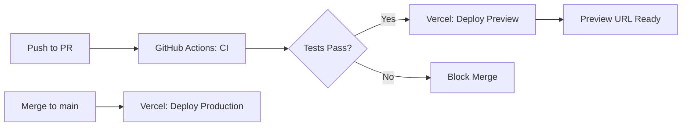

# Kairo - Deployment & CI/CD Guide

## Git Repository Structure

This is a **monorepo** with a single Git repository at the root level:

```
/home/blac3k/pruebas/Kairo/  ← ONE Git repository here
├── apps/
│   └── web/                  ← Next.js app (deployed to Vercel)
├── packages/                 ← Shared packages (future)
├── .github/workflows/        ← CI/CD workflows
├── .gitignore               ← Root ignores
└── vercel.json              ← Vercel monorepo config
```

## Initial Setup

### 1. Initialize Git Repository

```bash
cd /home/blac3k/pruebas/Kairo
git init
git add .
git commit -m "feat: initial commit - Kairo Phase 1 setup"
```

### 2. Create GitHub Repository

1. Go to https://github.com/new
2. Create a new repository named `kairo` (or your preferred name)
3. **DO NOT** initialize with README, .gitignore, or license (we already have these)
4. Keep it **private** for now (you can make it public later)

### 3. Connect to GitHub

```bash
git remote add origin git@github.com:YOUR_USERNAME/kairo.git
git branch -M main
git push -u origin main
```

## Vercel Deployment Setup

### Option 1: Vercel GitHub Integration (Recommended)

This is the **easiest and most powerful** approach:

1. **Connect to Vercel:**
   - Go to https://vercel.com/new
   - Click "Import Git Repository"
   - Select your `kairo` repository
   - Vercel will auto-detect it's a monorepo

2. **Configure Project:**
   - **Framework Preset:** Next.js
   - **Root Directory:** `apps/web` ← IMPORTANT!
   - **Build Command:** `pnpm build` (auto-detected)
   - **Output Directory:** `.next` (auto-detected)
   - **Install Command:** Leave blank (uses root pnpm-lock.yaml)

3. **Add Environment Variables:**
   ```
   NEXT_PUBLIC_SUPABASE_URL=https://xxx.supabase.co
   NEXT_PUBLIC_SUPABASE_ANON_KEY=eyJxxx...
   SUPABASE_SERVICE_ROLE_KEY=eyJxxx...
   NEXT_PUBLIC_APP_URL=https://your-app.vercel.app
   ```

4. **Deploy:**
   - Click "Deploy"
   - Vercel will build and deploy `apps/web`

### Option 2: Vercel CLI (Alternative)

```bash
# Install Vercel CLI
pnpm add -g vercel

# Login to Vercel
vercel login

# Deploy from root
cd /home/blac3k/pruebas/Kairo
vercel

# Follow prompts:
# - Set up and deploy? Yes
# - Which scope? Your account
# - Link to existing project? No
# - Project name? kairo
# - In which directory is your code? apps/web
```

## CI/CD Pipeline Flow

### Automatic Workflows



### What Happens on Each Push

#### Pull Request (PR)
1. **GitHub Actions runs** (`.github/workflows/ci.yml`):
   - ✅ Type checking (`pnpm type-check`)
   - ✅ Linting (`pnpm lint`)
   - ✅ Build verification (`pnpm build`)
   - ✅ Tests (when implemented)

2. **Vercel automatically**:
   - 🚀 Deploys a preview URL
   - 💬 Comments on PR with preview link
   - ✅ Runs its own build checks

#### Merge to `main`
1. **GitHub Actions runs** (same checks)
2. **Vercel automatically**:
   - 🚀 Deploys to production
   - ✅ Updates production URL

### Branch Protection Rules (Recommended)

Set these up on GitHub to enforce quality:

1. Go to: **Settings → Branches → Add rule**
2. **Branch name pattern:** `main`
3. Enable:
   - ✅ Require pull request before merging
   - ✅ Require status checks to pass:
     - Select: `Code Quality & Tests` (from CI workflow)
   - ✅ Require conversation resolution before merging
   - ✅ Do not allow bypassing the above settings

This ensures:
- No direct pushes to `main`
- All changes go through PR review
- CI must pass before merge
- Automatic deployment after merge

## Deployment Environments

### Preview (PR Deployments)
- **URL:** `kairo-git-{branch}-{username}.vercel.app`
- **Purpose:** Test changes before merging
- **Lifecycle:** Deleted when PR is closed

### Production
- **URL:** `kairo-{username}.vercel.app` (can add custom domain later)
- **Purpose:** Live application
- **Deployed from:** `main` branch only

## Monorepo Benefits

### Why One Repository?
1. **Atomic changes:** Update web + mobile in one commit
2. **Shared code:** Types, utils, components shared across apps
3. **Consistent tooling:** One set of configs for all apps
4. **Easier deployment:** Vercel handles monorepos natively

### .gitignore Strategy
- **Root .gitignore:** Global ignores (node_modules, .env, etc.)
- **App .gitignore:** App-specific ignores (Next.js .next/, etc.)
- Both work together - no conflicts!

## Environment Variables Strategy

### Local Development (`.env.local`)
```bash
# apps/web/.env.local (NEVER commit this!)
NEXT_PUBLIC_SUPABASE_URL=http://localhost:54321
NEXT_PUBLIC_SUPABASE_ANON_KEY=local-dev-key
SUPABASE_SERVICE_ROLE_KEY=local-service-key
```

### Vercel (Production & Preview)
Add in Vercel dashboard:
- **Production:** `main` branch values
- **Preview:** Same as production (or separate preview Supabase project)

### GitHub Actions (CI)
Add as **GitHub Secrets**:
- Settings → Secrets and variables → Actions → New repository secret
- Add non-sensitive build-time variables only

## Troubleshooting

### Build Fails on Vercel

```bash
# Test build locally first
cd apps/web
pnpm build

# Check for TypeScript errors
pnpm type-check

# Check for lint errors
pnpm lint
```

### Monorepo Not Detected

Check `vercel.json` in root:
```json
{
  "buildCommand": "cd apps/web && pnpm build",
  "installCommand": "pnpm install"
}
```

### Preview Deployment Not Working

1. Check Vercel integration is installed on GitHub
2. Verify `apps/web` is set as root directory in Vercel settings
3. Check GitHub Actions logs for errors

## Adding More Apps (Future)

When you add `apps/mobile`:

1. **Git:** No changes needed (already in monorepo)
2. **CI:** Update `.github/workflows/ci.yml` to test mobile too
3. **Deployment:** Add separate Vercel project for mobile (or use Expo EAS)

```bash
# Example: Add mobile testing to CI
- name: Test mobile
  run: pnpm --filter mobile test
```

## Useful Commands

```bash
# Deploy preview manually
vercel

# Deploy production manually
vercel --prod

# Check deployment status
vercel ls

# View logs
vercel logs [deployment-url]

# Add environment variable
vercel env add NEXT_PUBLIC_SUPABASE_URL production
```

## Next Steps

1. ✅ Initialize Git (`git init`)
2. ✅ Create GitHub repository
3. ✅ Push code (`git push`)
4. ✅ Connect to Vercel
5. ✅ Configure environment variables
6. ✅ Set up branch protection rules
7. ✅ Make first deployment
8. 🎉 Start developing!

---

**Questions?**
- Vercel Docs: https://vercel.com/docs/concepts/monorepos
- GitHub Actions: https://docs.github.com/en/actions
- Next.js Deployment: https://nextjs.org/docs/deployment
